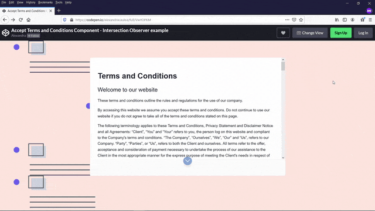

# Accept Terms and Conditions Component

A responsive Accept Terms and Condition Component.

I've used Intersection Observer API to check if an element is intersecting on the page, and base on it behavior I will show or hide the buttons.

[Live Example on CodePen](https://codepen.io/alexandracaulea/full/VwYOPKM)

